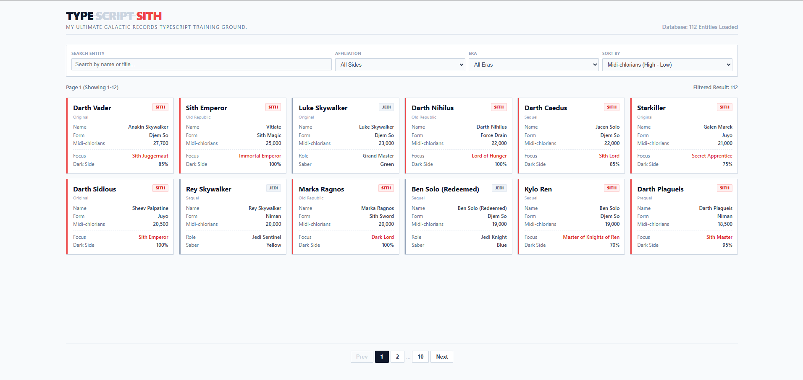

# [WIP] TypeSith: Ultimate Galactic Codex

## https://typesith.vercel.app

My TypeScript Training ground.

## Architecture & System Design Documentation

[Documentation](https://dainty-custard-bd9ec7.netlify.app/)

Developed as a focused, (maybe)frontend-only Training-project to practice with TypeScript fundamentals and complex UI state management. 'TypeSith' is a highly interactive, minimalist database (maybe use Mock data, this weekend I'm lack of free time) application cataloging 112 Force-sensitive entities. Embracing a top-down learning approach, I engineered this project to handle heavy data manipulation entirely on the client side without relying on a backend. The core technical challenges I overcame included implementing Discriminated Union Types for varied data structures, executing complex multi-condition array filtering and sorting, and building a dynamic pagination system from scratch. This project significantly strengthened my ability to write strictly typed, predictable code while delivering a seamless, responsive user experience.
